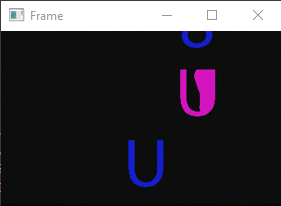
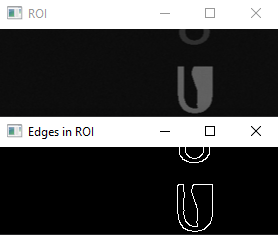
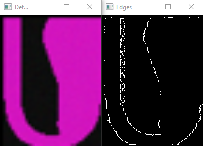
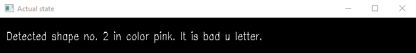
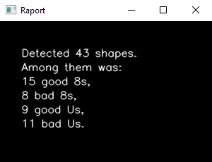

# Video processing
Processing a video sample with Python and OpenCV library. <br>

The video file is a simple letters and digits factory. They are moving from top to bottom. <br>
Among them there are some good and some defected ones. <br>
After program starts the functons are detecting and describing a type of each shape, it category (good or bad) and its' color. <br>

In the end there is displaying final raport.

## Technologies
Project is created with:
* Python 3.11
* numpy library version: 1.24.1
* OpenCV library version: 4.7.0

## First of all install requred libraries by runing:

* for Windows:
```
pip -r install requirements.txt
```

* for Linux:
```
pip3 install -r requirements.txt
```

## Program descripction

The captured video fle is OKNO_4.avi

First of all I declared upper and lower [limits](https://www.rapidtables.com/convert/color/rgb-to-hsv.html) for each of detected color:

```
lower_pink = np.array([150,50,50])
upper_pink = np.array([180,255,255])

lower_green = np.array([240, 80, 80])
upper_green = np.array([255, 255, 255])

lower_blue = np.array([110,50,50])
upper_blue = np.array([130,255,255])
```

### Program process video in this order:
- Change color [space](https://docs.opencv.org/4.x/df/d9d/tutorial_py_colorspaces.html) from RGB to GRAY scale

    - Create Region Of Intrest (ROI)
    - Take a part of image from ROI for edges detection using [Canny](https://docs.opencv.org/4.x/da/d22/tutorial_py_canny.html) filter

- Find a contours in detected shape
- After shape was detected I'm changing a color [space](https://docs.opencv.org/4.x/df/d9d/tutorial_py_colorspaces.html) again from RGB to HSV:
```
hsv = cv2.cvtColor(shape_img, cv2.COLOR_BGR2HLS)
```
- Put a mask on detected shape
- Count non-zero (no black) pixels in spicified shape
- Categorising detected shape and displaying real-time data of it

#### Additionaly I added a two user actions:
* pausing a video by pressing 'space'
* closing a program, and displaying actual final raport by presing 'q'

#### Program display following windows:
* Frame - main video file: <br>


* ROI and edges detected in it: <br>


* Detected shape and it's edges: <br>


* Actual state information: <br>


* Final raport after video ends or ures press 'q': <br>
 

<br>

# Image processing

In directory [img_processing](/img_processing/) there are two Jupyter Notebook files:
* [Img_processing](/img_processing/Img_processing.ipynb)

* [PC_camera_use](/img_processing/PC_camera_use.ipynb)

In Img_processing there are shown some functionalities of OpenCV library such as:
* converting video file to another type
* display video in Jupyter Notebook
* reading metadata od a video file
* selecting specified frames and saving them as new files
* selecting multiple frames from a video
* detecting contours of shapes in image
* show hierarhy of shapes in image